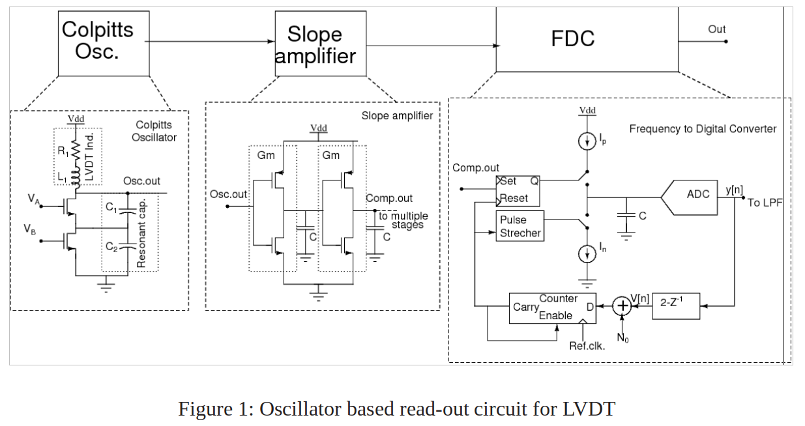

## Design of oscillator based read-out circuit for LVDT

##System Description

A simple and novel alternative method for LVDT signal conditioning is demonstrated in this  work. In the proposed method, the primary coil of the transducer is left unused and hence avoids the use of low distortion sine wave oscillators for primary coil excitation and the associated phase compensation circuitry. The proposed read-out circuit uses the secondary coil of an LVDT as part of a colpitts oscillator along with a frequency counter to derive the position information.

The proposed circuit consists of three major circuit blocks. They are (a) An active oscillator circuit for converting the LVDT inductance to frequency information, (b) a slope amplifier to convert the inductance information suitable for time domain signal processing and (c) a Frequency to Digital converter (FDC) to derive the frequency information in digital domain. Figure 1 below shows the complete circuit blocks with its schematics. 

The description of each of these ciruit blocks , its specification, design procedure, I/O pin description, the results obtained on prelayout and postlayout simulations are discussed in detail below. 

##Circuit schematic, design description, specifications and I/O pin description of individual blocks

The circuit details of integrated colpitts oscillator and slope amplifier is presented first, following which the circuit details of FDC is available.

###Integrated Colpitts oscillator and slope amplifier

####Design specifications

The circuit schematic of the single ended common base colpitts oscillator is shown in Figure 1. In this circuit, L1, C1 and C2 constitute the tank circuit of the Colpitts oscillator, and L1 and R1 together represent one of the secondary coils of the LVDT. For the LVDT used, the typical value of secondary inductance when the core is at the null position is in the order of 10mH and the value of R1, is 68 Ω. LVDTs are usually operated at low frequencies (2KHz -10KHz). So in order to make the coils resonate around 10KHz, the combination of C1 and C2 capacitance should be chosen in the order of 25 nF. Owing to the size of the LVDT inductance and the resonant capacitance, these are implemented off chip. The bias voltage VA and VB is also derived off chip. Therefore, the oscillator block needs 4 external analog I/O pins.  The device dimensions for the colpitts oscillator are chosen in such a way that the jitter contribution is solely due to the LVDT inductor (around 400ps). As the  output of the colpitts oscillator swings with the supply voltage as its common mode, the supply voltage used for this stage is 1.8V.  Also, as the devices has to tolerate the swings levels at the output, high voltage devices (5V) are chosen for the entire design, and supply for the subsequent stages is chosen to be 3.3V. Next, the design of slope amplifier is discussed. 

Slope amplifier is used as an interface between the analog and the time domain signal. The process of slope amplification adds noise. [1] and associated references reports a slope amplification of a 30 kHz signal achieved using multiple stages of Gm-C integrators. It suggests an effective way of designing the Gm-C integrators such that the noise folding from aliasing that is caused during slope amplification will be minimum. This work also presents an analytical way of jitter estimation for the Gm-C integrator, that matches closely with the jitter estimates obtained from the PSS simulation in spectre tool. This analytical design technique is considered for the present work for chosing the device dimensions of the slope amplifier that results in a jitter contribution of only around 40ps from the three stages of Gm-C integrator  that is used. 

The circuit schematic of a three stage Gm-C integrator along with the colpitts oscillator with the device dimensions is shown in figure 2 (available in the folder-file name xscheme; file name: colpitts_slopeamp.sch) . The value of inductance chosen is 10mH and the effective capacitance is 31nF, making the circuit to oscillate at 8.9kHz. The loop gain for the oscillaor is high enough to make the oscillator work as desired across all process corners and oscillations has been verified across all process corners. The testbench used for simulations is included in the xschem file

A snapshot of the layout for the above circuit is shown in figure 3. The mag file is available in the folder named ‘layout’ (file name:colpitts_slopeamp.mag). The transistors and the capacitors corresponding to figure 2 is labelled in the layout. Owing to the higher device dimensions of these transistors, all of them are realised using multifingers. Each transistors has dummies on its left and right and a guard ring is placed sorrounding it. Substrate contacts are placed are inbetween the transistors to avoid DRC violations. The top and bottom blue metal lines indicate vdd and vss respectively. This design is LVS cleared, and the results from netgen are available in the folder named ‘lvs’ (filename:colpitts_slopeamp.out)  After parasitic RC extraction, postlayout simulations has been carried out with the extracted spice netlist. The extracted spice netlist is available in the folder named ‘postlayout’ (filename: colpitts_slopeamp_postextracted.spice)  A snapshot of the postlayout simulation results is shown in figure 3. As shown in figure 2, ‘vout’ indicates the output from colpitts oscillator. The oscillations occur at a frequency of 8.9kHz for the chosen value of inductance and capacitances. ‘vout1’, ‘vout2’ and ‘vout3’ are the outputs from stage 1, 2 and 3 of the slope amplifier respectively. The slope gain at the output of colpitts oscillator is around 55KV/s, whereas at the output of three stages of the slope amplifier, the slope gain is 0.6GV/s. This output from the slope amplifier is further fed to the FDC for processing. 

###Frequency to Digital converer

####Design specifications

####Circuit operation of FDC and its verification in prelayout simulation

The circuit schematic of the frequency to digital converter is shown in figure 1. It consists of a charge pump and associated gating logic that constitutes a Phase detector, a 3-b ADC (5 levels), a filtering block, a digital constant adder, a 5-b counter, and a pulse stretcher. Two events control the timing: 1) transition of input from low to high and 2) transition of the “Carry” signal from low to high. The 5-b counter is driven by an 200 kHz external clock, and the “Carry” signal goes high on its terminal count. In normal operation, the Q output of the flip flop goes high when the input goes high. This causes the positive current source in the charge pump, Ip to be connected to the capacitor. This current source remains connected to the capacitor until the “Carry” signal goes high, at which time it is disconnected from the capacitor. The negative current source, In  is connected to the capacitor for a fixed duration (42.5us) each time the “Carry” signal goes high.  After the “Carry” signal goes high, the counter is loaded with a number obtained by filtering the ADC output. This effectively sets the time until the next “Carry,” that closes the feedback loop. This loop operates similar to a second order sigma delta modulator and has all advantages of noise shaping that a sigma delta modulator posses.

The flip flops in phase detector, counter, filter and adder blocks shown in figure 1 is realized using standard cells , whereas the charge pump and ADC are realized using analog circuit elements. The circuit schematic for the FDC is available in the ‘xschem’ folder (sub-folder: ‘FDC’;file name :fdc_complete_loop.sch)).  The complete closed loop operation has been verified in simulations. A short description of the expected numbers at different places in the loop is given below.

The FDC loop takes only fixed frequency DC inputs from the slope amplifier and operates   with a nominal center frequency of 10kHz. Based on the capacitor voltage range (0 to 3.3V), 5 levels to the ADC is assigned (0V to 0.66V: -2 level ; 0.66V to 1.32V: -1 level; 1.32V to 1.98V: 0 level; 1.98V to 2.64V:1 level; 2.64V to 3.3V: 2 level).  The output from the ADC is represented in the two’s complement form. Therefore, when the input to the FDC is exactly at 10kHz, the voltage stored at the capacitor must be 1.65V (supply/2), and the ADC resolves this input as 0 level.  A snapshot of the simulation result under this condition is shown in figure 5. 

From figure 5, it can be seen that the capacitor voltage settles to 1.65V after a transient and the corresponding ADC output levels is 0 (000- MSB at the top). It can also be seen from the simulation results that the ADC resolves the other levels when there is a initial transient in the loop, before the loop locks.

####Layout of FDC

The layout for the digital portions of the FDC has been carried out using openlane. Verilog code has been written for the digital portions and its RTL functionality is verified using iverilog. Independant description for the digital portion is available in the Readme.md file associated with the folder 'verilog'

The layout for the analog portions , comparator and charge pump has been carried out using MAGIC tool. The schematic for the comparator is available in the folder named ‘xschem’ (filename: strongarmlatch.sch) and the corresponding layout for the comparator is available in the folder named ‘layout’ (sub-folder: ‘mag files’ , file name: ‘strongarmlatch.mag’). The layout is LVS cleared and the results of LVS is available in the folder named ‘lvs’ (file name: strongarmlatch.out) . The RC extracted spice netlist is available in the folder named ‘postlayout’ (file name: strongarmlatch_postextraction.spice). A snapshot of the the postlayout simualtion results is given in figure 6.  The top signal is the input to the comparator , following which is the reference of 1.65V and a clock signal . At every clock signal, the comparison takes place, and when the input exceeds the reference the output signal is set high (green colour)

The layout for charge pump , has been carried out and is available in the folder named ‘layout’ (filename: ‘chargepump.mag’). The layout is LVS cleared and postlayout simulations of the  extracted spice netlist with parasitics has been carried out. The pre-layout and post-layout simulations do not match and some debuggigng needs to be done with it.

###Checklist for tape-out
From the above discussions , a complete checklist of the completed/ to-be-completed tasks before the tapeout deadline is given below
 
